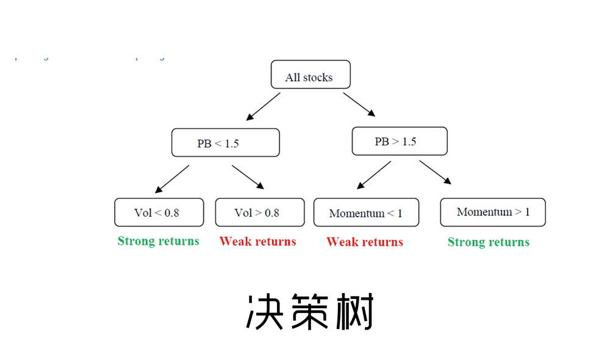

## Coursera Machine Learning Assignments in Matlab
 
 
 

## Introduction
---
这是Coursera网站上，课程[Machine Learning](https://www.coursera.org/learn/machine-learning)中算法在Matlab语言的实现，同样也可以参考斯坦福大学的计算机课程[CS229](http://open.163.com/special/opencourse/machinelearning.html)。

### Attention：
---
* 你可以在[百度云](https://pan.baidu.com/s/1qZlQFoS)上下载全套课程视频和相关文档；
* 如果需要课程代码在python语言的实现，可以参考我在[github](https://github.com/SHIMengjie/Machine-Learning-Andrew-Ng-Python)上的另一个代码仓库。

### Definition
---
* "A computer program is said to learn from experience E with respect to some task 
T and some performance measure P, if its performance on T, as measured by P, improves with experience E." 
-------------- Definition of Machine Learning by Tom Mitchell

### Enviroment
---
* Windows10
* Matlab 2017b

### Target
---
* 掌握机器学习的算法原理与推理过程；
* 掌握机器学习算法在Matlab语言的实现过程和细节；

## Contents
- README.md：说明文档
#### [Exercise 1](https://github.com/SHIMengjie/Machine-Learning-Andrew-Ng-Matlab/tree/master/exercise-1)
* Linear Regression
* Linear Regression with multiple variables
#### [Exercise 2](https://github.com/SHIMengjie/Machine-Learning-Andrew-Ng-Matlab/tree/master/exercise-2)
* Logistic Regression
* Logistic Regression with Regularization
#### [Exercise 3](https://github.com/SHIMengjie/Machine-Learning-Andrew-Ng-Matlab/tree/master/exercise-3)
* Multiclass Classification
* Neural Networks Prediction fuction
#### [Exercise 4](https://github.com/SHIMengjie/Machine-Learning-Andrew-Ng-Matlab/tree/master/exercise-4)
* Neural Networks Learning
#### [Exercise 5](https://github.com/SHIMengjie/Machine-Learning-Andrew-Ng-Matlab/tree/master/exercise-5)
* Regularized Linear Regression
* Bias vs. Variance
#### [Exercise 6](https://github.com/SHIMengjie/Machine-Learning-Andrew-Ng-Matlab/tree/master/exercise-6)
* Support Vector Machines
* Spam email Classifier
#### [Exercise 7](https://github.com/SHIMengjie/Machine-Learning-Andrew-Ng-Matlab/tree/master/exercise-7)
* K-means Clustering
* Principal Component Analysis
#### [Exercise 8](https://github.com/SHIMengjie/Machine-Learning-Andrew-Ng-Matlab/tree/master/exercise-8)
* Anomaly Detection
* Recommender Systems
### [gaussianDemo](https://github.com/SHIMengjie/Machine-Learning-Andrew-Ng-Matlab/tree/master/gaussianDemo)
* Simple Gaussian Process Regression

## Acknowledge

<b>你可以检查与修改我在[github](https://github.com/SHIMengjie/Machine-Learning-Andrew-Ng-Matlab)上的代码仓库，欢迎任何改进和讨论。</b>
