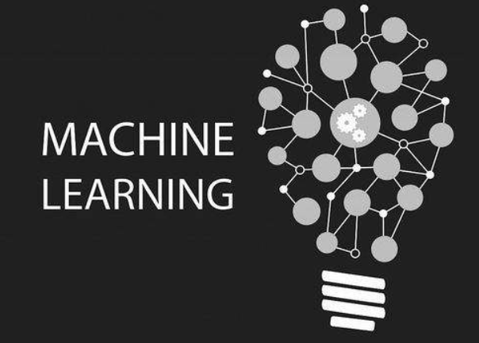

These are the programming assignments from Coursera's Machine Learning course taught by Andrew Ng.

Include:\
- Linear Regression (one variable and multiple variables)\
- Logistic Regression\
- Regularization\
- Neural networks\
- Support Vector Machine\
- Clustering\
- Dimensionality Reduction\
- Anomaly Detection\
- Recommender System\

For more information, please visit:
https://class.coursera.org/ml/lecture/preview


# Machine Learning

<b>LIKE KINDA SUPER IMPORTANT NOTE</b>: Hi! Q here. Your most likely reading this and really excited about building your own AI. I was too in 2011 when I had a dream of building an AI to solve all of humanitie's problems. My most up to date research in artificial general intelligence(AGI) can be found in my other github repo [wAlnut](https://github.com/WalnutiQ/wAlnut). 

## Why
The majority of the material here was created while taking Andrew Ng's free online 
[Machine Learning class](https://www.coursera.org/learn/machine-learning) which I highly recommend!

*"A computer program is said to learn from experience E with respect to some task 
T and some performance measure P, if its performance on T, as measured by P, improves with experience E."*

~ Definition of Machine Learning by Tom Mitchell

## How 
1. Install [Octave free here](https://db.tt/J97Im052) or [Matlab not free here](http://www.mathworks.com/products/matlab/). Note that Octave = Matlab without the nice graphical user interface. I use Octave so don't feel like you are missing anything if you don't have money for Matlab.

2. Fork this repository and clone it locally! Navigate into specific folders (made them very specific) and look at the `README.md` file for that specific folder for which file(s) to run to see examples of what machine learning algorithms can do for you. Enjoy!

## What each file/folder in this repo is for
- [diagnosticTests](./diagnosticTests) = tests that will give you insight into what is & isn't working with a learning algorithm

- imagesForExplanation = contains images used in other folder's `README.md` files for explanation so don't worry about this
folder

- supervisedLearning = teach the computer how to learn
  + [linearRegressionIn1Variable](./supervisedLearning/linearRegressionIn1Variable)
  + [linearRegressionInMultipleVariables](./supervisedLearning/linearRegressionInMultipleVariables)
  + [logisticRegression](./supervisedLearning/logisticRegression)
  + [LinearAlgebraReview.md](./supervisedLearning/LinearAlgebraReview.md)

- unsupervisedLearning = let the computer learn by itself
  + neuralNetworks
    - [digitRecognition](./unsupervisedLearning/neuralNetworks/digitRecognition)
    - [learningWithBackpropagation](./unsupervisedLearning/neuralNetworks/learningWithBackpropagation)

- README.md = the file you are reading right now


# Coursera Machine Learning Assignments in Python
[](https://www.linkedin.com/in/soojinro) []() []() []()



## About
If you've finished the amazing introductory Machine Learning on Coursera by Prof. Andrew Ng, you probably got familiar with Octave/Matlab programming. With this repo, you can re-implement them in Python, step-by-step, visually checking your work along the way, just as the course assignments.

## How to start
### Dependencies
This project was coded in Python 3.6
* numpy
* matplotlib
* scipy
* scikit-learn
* scikit-image
* nltk

### Installation
The fastest and easiest way to install all these dependencies at once is to use [Anaconda](https://www.continuum.io/downloads).


## Important Note
There are a couple of things to keep in mind before starting.
* all column vectors from octave/matlab are flattened into a simple 1-dimensional ndarray. (e.g., y's and thetas are no longer m x 1 matrix, just a 1-d ndarray with m elements.)
So in Octave/Matlab, 
    ```matlab
    >> size(theta)
    >> (2, 1)
    ```
    Now, it is
    ```python
    >>> theta.shape
    >>> (2, )
    ```
* numpy.matrix is never used, just plain ol' numpy.ndarray

## Contents
#### [Exercise 1](https://github.com/nsoojin/coursera-ml-py/tree/master/machine-learning-ex1)
* Linear Regression
* Linear Regression with multiple variables
#### [Exercise 2](https://github.com/nsoojin/coursera-ml-py/tree/master/machine-learning-ex2)
* Logistic Regression
* Logistic Regression with Regularization
#### [Exercise 3](https://github.com/nsoojin/coursera-ml-py/tree/master/machine-learning-ex3)
* Multiclass Classification
* Neural Networks Prediction fuction
#### [Exercise 4](https://github.com/nsoojin/coursera-ml-py/tree/master/machine-learning-ex4)
* Neural Networks Learning
#### [Exercise 5](https://github.com/nsoojin/coursera-ml-py/tree/master/machine-learning-ex5)
* Regularized Linear Regression
* Bias vs. Variance
#### [Exercise 6](https://github.com/nsoojin/coursera-ml-py/tree/master/machine-learning-ex6)
* Support Vector Machines
* Spam email Classifier
#### [Exercise 7](https://github.com/nsoojin/coursera-ml-py/tree/master/machine-learning-ex7)
* K-means Clustering
* Principal Component Analysis
#### [Exercise 8](https://github.com/nsoojin/coursera-ml-py/tree/master/machine-learning-ex8)
* Anomaly Detection
* Recommender Systems

## Solutions
You can check out my implementation of the assignments [here](https://github.com/nsoojin/coursera-ml-py-sj). I tried to vectorize all the solutions.
